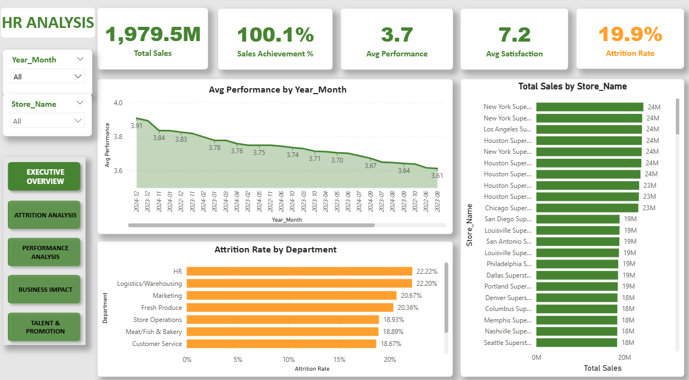
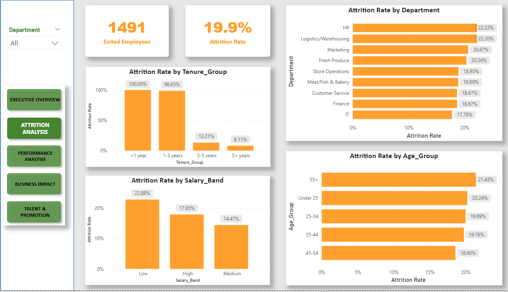
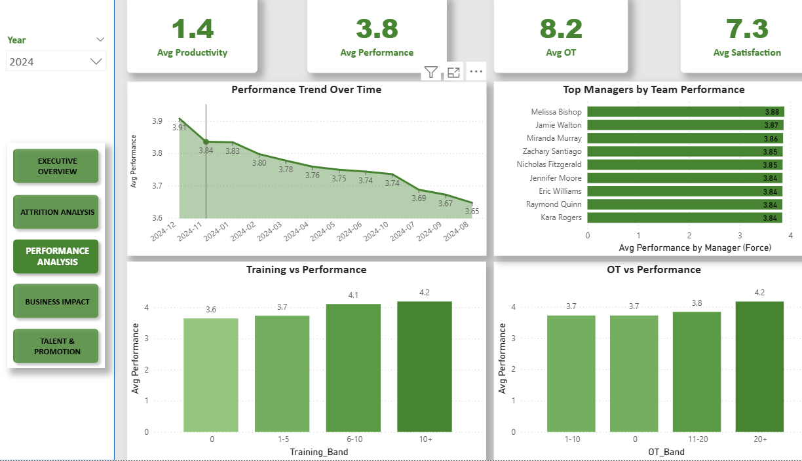
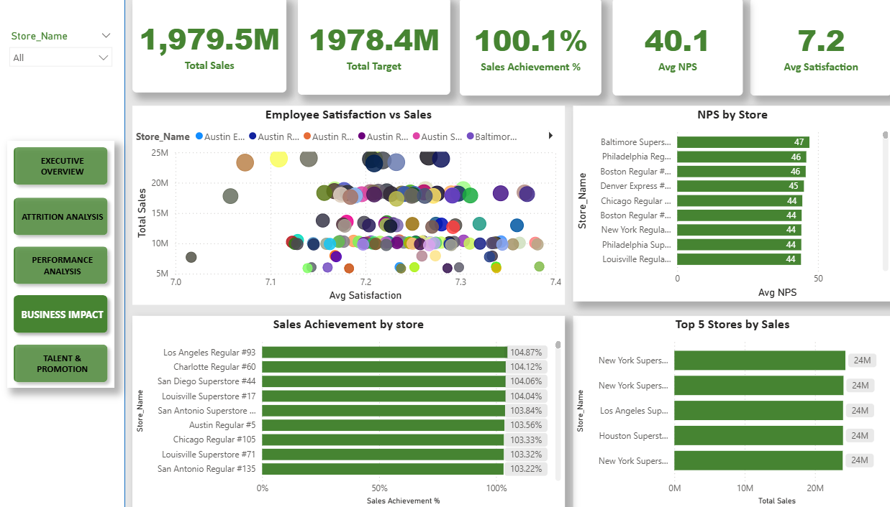
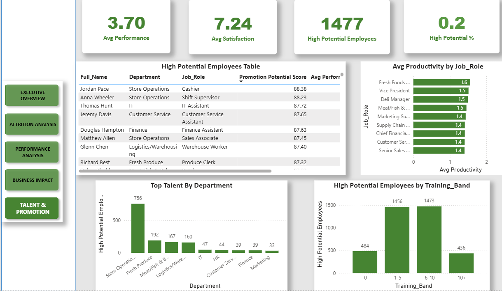

# HR Analytics Insight Report

## 1. Executive Summary

This report summarizes the key insights from the **HR Analytics: Workforce Performance & Business Outcomes** project. The analysis combines SQL, Python exploratory data analysis, and Power BI dashboard visualization to evaluate workforce performance, employee attrition, satisfaction, productivity, store sales outcomes, and promotion potential.

Overall, the company is performing well from a business perspective. Total sales reached approximately **1,979.5M**, slightly above the target of **1,978.4M**, with a sales achievement rate of around **100.1%**. Employee performance is relatively stable, with an average performance score of approximately **3.7**, and employee satisfaction averages around **7.2**.

However, the company faces a clear workforce retention challenge. The overall attrition rate is approximately **19.9%**, with higher attrition concentrated in specific departments, lower salary groups, and early-tenure employees.

The main business message is that while the company is achieving its sales targets, it needs to strengthen employee retention, improve training effectiveness, and use data-driven talent development to sustain long-term performance.

---

## 2. Data and Analytical Approach

This project follows an end-to-end data analytics workflow:

- **SQL** was used to validate, join, aggregate, and query data from multiple HR and business tables.
- **Python** was used for exploratory data analysis, statistical summaries, correlation analysis, and visualization.
- **Power BI** was used to build an interactive dashboard with five pages: Executive Overview, Attrition Analysis, Performance Analysis, Business Impact, and Talent & Promotion.

The analysis focuses on ten key business questions related to attrition, salary, performance, training, store sales, satisfaction, productivity, promotion potential, and age-performance relationships.

---

## 3. Key Insights

### 3.1 Business Performance Is Strong, but Retention Is a Concern

The executive dashboard shows that total sales reached approximately **1,979.5M**, slightly exceeding the target of **1,978.4M**. The sales achievement rate is around **100.1%**, indicating that the company is meeting its overall business target.

At the same time, the attrition rate is approximately **19.9%**, which is relatively high. This suggests that business performance is currently strong, but workforce stability may become a risk if attrition is not managed effectively.

**Business implication:**  
The company should not only focus on sales achievement but also prioritize employee retention to protect long-term business performance.

---

### 3.2 Attrition Is Concentrated in Specific Employee Groups

The company has **7,500 employees**, of which **1,491 employees have exited**, resulting in an attrition rate of approximately **19.88%**.

Attrition is highest in **HR** and **Logistics/Warehousing**, both at around **22%**. The dashboard also shows that employees with shorter tenure, especially those with less than three years of service, have much higher attrition rates. Employees in lower salary bands also show higher attrition compared to medium and high salary groups.

**Interpretation:**  
Attrition is not random. It is concentrated in departments, salary bands, and tenure groups that may experience higher workload pressure, weaker job fit, lower compensation attractiveness, or limited career development.

**Business implication:**  
Retention programs should focus on early-tenure employees, lower salary groups, and high-risk departments such as HR and Logistics/Warehousing.

---

### 3.3 Salary Is Mainly Driven by Job Level

The salary analysis shows that compensation is strongly related to **job level**. Executive, Senior Manager, and Manager roles have much higher average salaries than entry-level roles.

Department-level salary differences exist, but they are smaller than job-level differences. This suggests that the compensation structure is mainly based on hierarchy and seniority.

**Business implication:**  
The salary structure appears logical by job level, but departments with high attrition should still be reviewed to determine whether compensation competitiveness contributes to turnover.

---

### 3.4 Employee Performance Peaks Toward the End of the Year

The performance analysis shows that employee performance tends to peak near the end of the year, especially around **December**. December 2024 reaches an average performance score of approximately **3.91**.

This may be related to year-end business targets, seasonal sales activities, performance review cycles, or stronger employee motivation during peak business periods.

**Business implication:**  
Management should study what drives stronger year-end performance and apply those practices to other months. This may include clearer targets, stronger incentives, focused coaching, or improved workforce planning.

---

### 3.5 Manager Effectiveness Influences Team Performance

Manager performance was evaluated based on the average performance score of their team members. Top managers such as **Melissa Bishop**, **Nicholas Fitzgerald**, **Jamie Walton**, and **Miranda Murray** lead teams with average performance scores around **3.8**.

The differences between top managers are relatively small, but these managers consistently lead high-performing teams with large team sizes, making the results meaningful.

**Business implication:**  
The company should study the leadership practices of top-performing managers and use them as examples for manager training and team performance improvement.

---

### 3.6 Training Has a Positive but Limited Relationship with Performance

Python analysis shows a positive correlation between training hours and performance, with a correlation value of approximately **0.24**. This means employees who receive more training tend to perform slightly better, but training hours alone do not fully explain performance differences.

The dashboard also shows that employees in higher training bands generally have better performance. However, this does not mean that simply increasing training hours will always improve performance.

**Business implication:**  
The company should focus on training quality, role-specific content, and practical application rather than only increasing training hours.

---

### 3.7 Store Sales Performance Is Strongest in Large Superstores

The Business Impact dashboard shows that top-performing stores are mainly **Superstores** located in large cities such as New York, Los Angeles, and Houston.

The largest difference between top and bottom stores is total sales volume and sales achievement rate. Other indicators such as customer satisfaction, NPS, waste percentage, and on-time delivery are relatively similar across store groups.

**Interpretation:**  
High store sales are likely influenced by store scale, location, and customer traffic rather than customer satisfaction alone.

**Business implication:**  
The company should study top-performing Superstores to identify practices in staffing, sales execution, and store operations that can be adapted for lower-performing stores.

---

### 3.8 Logistics/Warehousing Requires Attention

The satisfaction analysis shows that **Store Operations** has the highest average employee satisfaction score, around **7.32**. In contrast, **Logistics/Warehousing** has the lowest average satisfaction score, around **7.12**.

Although the gap is not very large, Logistics/Warehousing is important because it also has a high attrition rate. This combination suggests potential issues related to workload, working conditions, scheduling, job stress, or career development.

**Business implication:**  
Logistics/Warehousing should be prioritized for deeper employee experience analysis and targeted improvement actions.

---

### 3.9 Productivity Differs Across Job Roles

The productivity analysis compares average Productivity Index across job roles. After filtering roles with enough employees, high-productivity roles include senior sales, supervisory, and selected operational roles.

This suggests that experience, job specialization, and operational knowledge may contribute to higher productivity.

**Business implication:**  
The company should identify best practices from high-productivity roles and use them to support training, coaching, and process improvement for lower-productivity roles.

---

### 3.10 High-Potential Employees Can Support Succession Planning

The Talent & Promotion dashboard identifies high-potential employees using a weighted score based on performance, satisfaction, engagement, and manager evaluation. Top candidates include **Jordan Pace**, **Anna Wheeler**, **Thomas Hunt**, **Jeremy Davis**, and **Douglas Hampton**.

These employees show strong performance, high satisfaction, strong engagement, and positive manager evaluation. The dashboard identifies **1,477 high-potential employees**, representing around **20%** of the workforce.

**Business implication:**  
The promotion potential score can be used as an initial screening tool for talent development and succession planning. However, final promotion decisions should still include qualitative evaluation from managers and HR.

---

### 3.11 Age Is Not a Strong Predictor of Performance

The age-performance analysis shows that the correlation between age and performance is close to zero. Differences between age groups are relatively small.

This means age alone does not meaningfully explain employee performance.

**Business implication:**  
HR decisions should focus on skills, experience, training, engagement, job role, and performance history rather than demographic assumptions about age.

---

## 4. Strategic Recommendations

### 4.1 Reduce Attrition in High-Risk Groups

The company should prioritize retention efforts for HR, Logistics/Warehousing, lower salary groups, and early-tenure employees.

Recommended actions:

- Improve onboarding for new employees
- Review workload and job stress in high-attrition departments
- Provide clearer career paths
- Strengthen manager support and coaching
- Conduct employee feedback surveys

---

### 4.2 Improve Training Effectiveness

Training has a positive relationship with performance, but the relationship is not strong enough to conclude that more hours alone will improve results.

Recommended actions:

- Evaluate training quality and relevance
- Build role-specific training programs
- Track post-training performance changes
- Focus on practical skills and job application

---

### 4.3 Learn from High-Performing Stores

Top-performing stores are mainly Superstores in large cities. Their performance should be studied to identify repeatable business practices.

Recommended actions:

- Compare staffing models between top and bottom stores
- Study sales execution strategies in top Superstores
- Identify store operation practices that can be replicated
- Support lower-performing stores with targeted action plans

---

### 4.4 Strengthen Employee Experience in Logistics/Warehousing

Logistics/Warehousing has both high attrition and low satisfaction, making it a priority department for HR intervention.

Recommended actions:

- Conduct department-level employee surveys
- Review workload, scheduling, and working conditions
- Improve manager communication and support
- Provide career development opportunities

---

### 4.5 Use Data-Driven Talent Development

Promotion potential analysis can help identify employees suitable for career advancement.

Recommended actions:

- Use promotion scores as an initial screening tool
- Combine data results with manager feedback
- Create leadership development plans for high-potential employees
- Monitor whether promoted employees continue to perform well after promotion

---

## 5. Conclusion

The HR Analytics project shows that the company is achieving its business targets while maintaining generally stable employee performance and satisfaction. However, the attrition rate remains relatively high, especially in specific departments, lower salary groups, and early-tenure employees.

The analysis highlights several opportunities for improvement: reducing attrition in high-risk groups, improving training effectiveness, learning from high-performing stores, supporting Logistics/Warehousing, and using data-driven promotion planning.

By combining SQL, Python, and Power BI, the project demonstrates a complete data analytics workflow that supports both HR decision-making and business performance improvement.